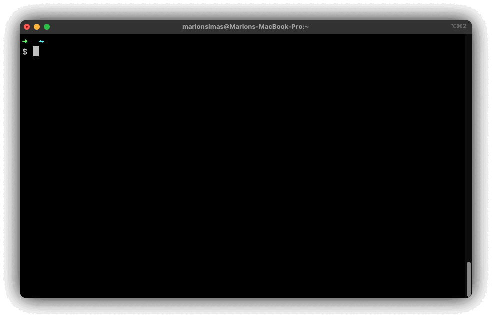

<div align="center">
 <h1><strong>EphEmail:  Ephemeral E-mail</strong></h1>

 A disposable, self-destructing (one could say, ephemeral) email address on your terminal.
</div>


# Demo




## Features

- Generate random e-mail address
- Select name and domain address (considering available domains addresses)
- Automatic listener to e-mail messages
- Read e-mails on the terminal
- Download those e-mail as a html file
- List and download e-mail attachments


## Installation

### Manually

Make sure you have Go installed

* Go >= 1.18

```curl
# Clone the Repo
git clone git@github.com:MarlonCorreia/ephemail.git

# Enter Folder
cd ephemail/

# Build the project
go build -o ephemail

# Run
./ephemail
```

### Compiled binaries

Binaries provided on the [Releases](https://github.com/MarlonCorreia/ephemail/releases) page

## Usage 
Instructions on navigation and commands are built in on the TUI, just run

```curl
# Generate random name and domain
./ephemail
```

```curl
# Provide name and domain
./ephemail --user <username> --domain <available_domain>
```

```curl
# List available domains addresses
./ephemail --list-domains
```

## Server

This is highly reliant on the amazing [💛 1secmailApi](https://www.1secmail.com/api/), so if their service is down, this TUI won't work. I'm currently studying the possibility of writing a companion e-mail server.

## License

This software is released under the [MIT License](https://github.com/MarlonCorreia/ephemail/blob/main/LICENSE)
